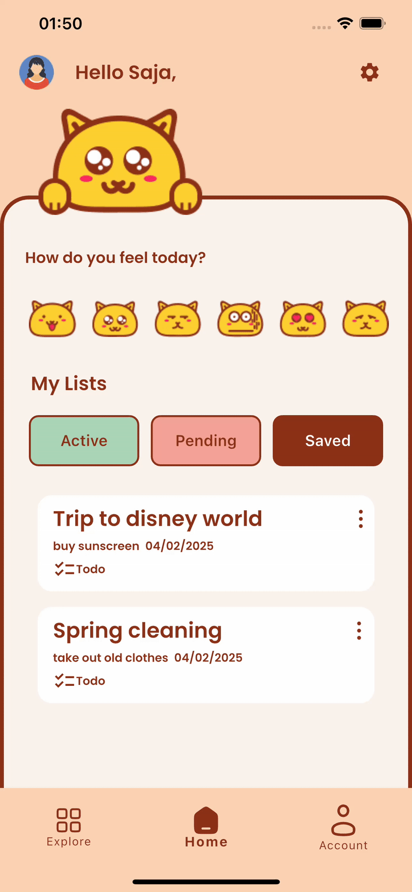

#  ✨ **Taskins** Mobile App 📱  ✨


## 📝 What is Taskins?

✨ Taskins is your go-to app for beating stress and staying on top of your to-dos! ✅ It’s designed to help you manage your tasks without overwhelm, with three sections:
1. 📝**Active Lists** – your current to-dos  
2. 🕒**Pending Lists** – paused projects you plan to finish  
3. ✅**Saved Lists** – completed lists you might want to revisit  


## 🎥 Taskins Screens


  
  
  
  
  
  
  
  
  
  


## ✅  Widgets used 

+ Navbar
+ Drawer
+ Bottom Sheet
+ AlertDialog
+ TextField
+ pageView
+ TbBar and TabBarView


## ✅ External packages used 

+ shimmer
+ animate
+ confetti 


## 🚀 How to Run the Taskins App

+ **📦 Prerequisites**  
  + Flutter SDK installed ([Download Flutter](https://docs.flutter.dev/get-started/install))  
  + Dart installed (usually included with Flutter)  
  + Git installed ([Download Git](https://git-scm.com/downloads))  
  + An Android Emulator, iOS Simulator, or a physical device connected  

+ **🛠️ Clone the Repository**  
  ```bash
  git clone https://github.com/Lamees56/App-Design-Implementation.git
  cd App-Design-Implementation


---

## ✨ Author 👩‍💻 💻

Lamees Al-Amri 

